# Задание 1. Повышение безопасности системы

**Основная задача — устранить уязвимости SSO, используя архитектуру, соответствующую международным требованиям.**

## Архитектурное решение

Цель — создать централизованную, но гибкую систему управления доступом.

Предлагаемая архитектура:

- Внедрение брокера идентификации:

        Это новый контейнер, который будет единственной точкой входа для всех внутренних приложений (API, CRM, Интернет-магазин).

        Брокер общается с внешними Identity Provider (IdP), такими как Keycloak, российскими или европейскими ЕСИА.

        Он реализует безопасный процесс обмена токенами: принимает токен от IdP и обменивает его на внутренние, не передавая внешние токены фронтенду.

        Это решает задачу унификации доступа, поддержки разных IdP и безопасной схемы работы с токенами.

- Изменение потока авторизации:

        Приложение для донастройки и Интернет-магазин больше не обращаются к Keycloak напрямую.

        Они перенаправляют пользователя на брокер идентификации, который определяет нужный IdP (в зависимости от страны пользователя), завершает OAuth-поток и возвращает внутренние access/refresh токены приложению.

[Обновленная диаграмма](./diagrams/bionicpro-c4-task1.drawio)

## Замена Code Grant на PKCE в Keycloak

PKCE (Proof Key for Code Exchange) необходим для защиты мобильных и SPA-приложений от атак с перехватом кода авторизации.

Ключевые шаги для реализации:

- Настройка Keycloak:

        Для клиента (приложения) в Keycloak в настройках Access Type выбрать public (а не confidential).

        Включить опцию Standard Flow Enabled и PKCE Enabled.

        В поле Valid Redirect URIs прописать точные URI фронтенда.

- Изменения во фронтенде:

        Использовать библиотеку oidc-client-ts или Auth0 SDK.

        Генерировать code_verifier (случайная строка) и его хэш SHA256 — code_challenge.

        При перенаправлении на Keycloak передавать code_challenge и метод S256.

        При обмене кода на токен передавать оригинальный code_verifier. Keycloak сверит его хэш с ранее полученным challenge.

Результат: Даже если злоумышленник перехватит код авторизации, он не сможет обменять его на токен без code_verifier.

# Задание 2. Разработка сервиса отчётов

**1. Разработана целевая архитектура для решения по формированию отчетности для пользователей.**

[Обновленная диаграмма](./diagrams/bionicpro-c4-task2.drawio)

**2. Разработать Airflow DAG и настроить его на запуск по расписанию.**

Реализован ETL-процесс с использованием Airflow, который извлекает данные из CRM-системы проводя аггрегацию с данными телеметрии и записывает их в базу OLAP.

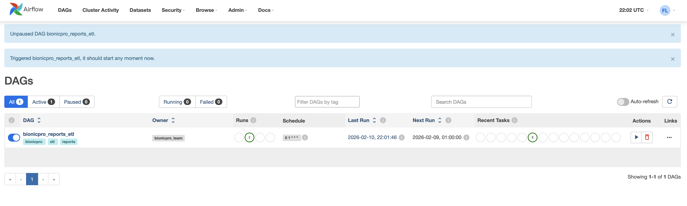
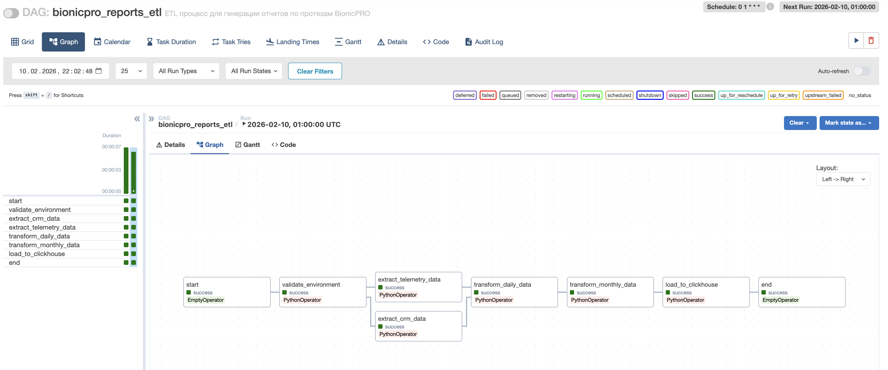
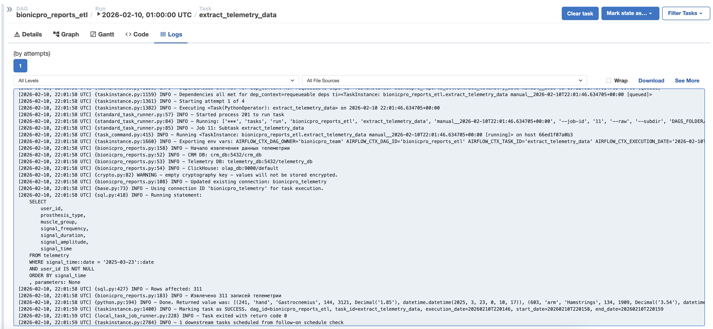
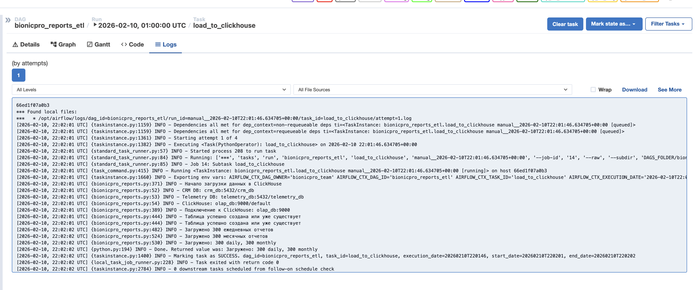

Подготовлена витрина — отдельная таблица для сервиса отчётов, в которой объединены данные телеметрии и данные о клиентах из CRM-системы. Структура витрины спроектирована таким образом, чтобы обеспечить быстрый доступ к данным по пользователям.

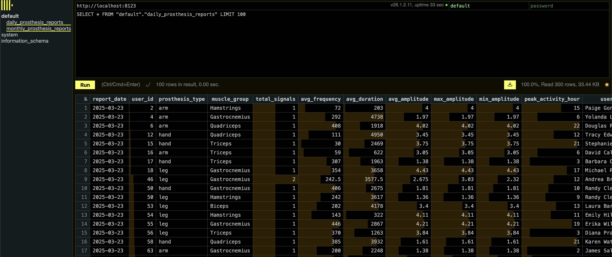

**3. Разработать бэкенд-часть приложения для API.**

На языке программирования C# (ASP>Net Core) реализован сервис отчетов, предоставляющий метод GET /reports, возвращающий подготовленный отчёт для пользователя. Отчёт запрашивается из OLAP-базы без необходимости выполнять сложные вычисления в реальном времени.

**4. Добавить в UI кнопку получения отчёта и вызова эндпоинта его генерации.**

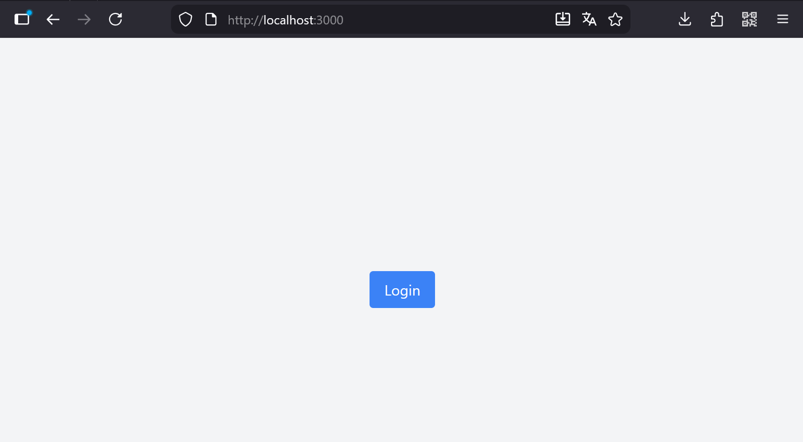
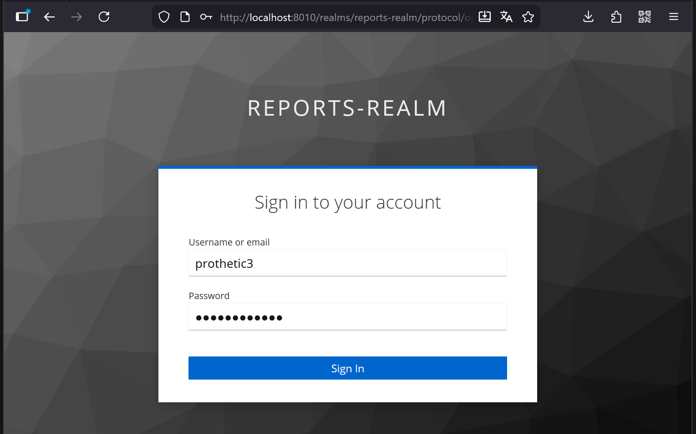
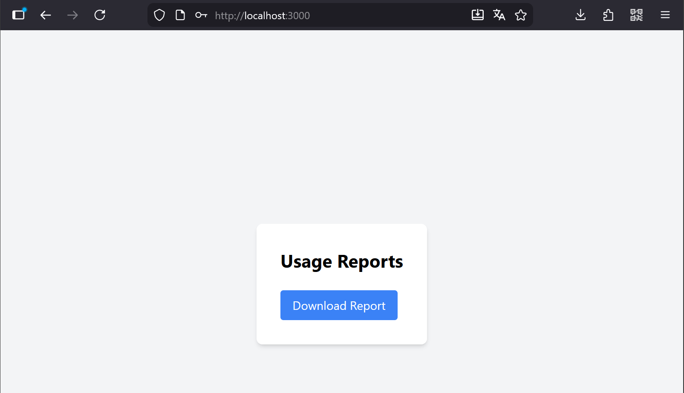
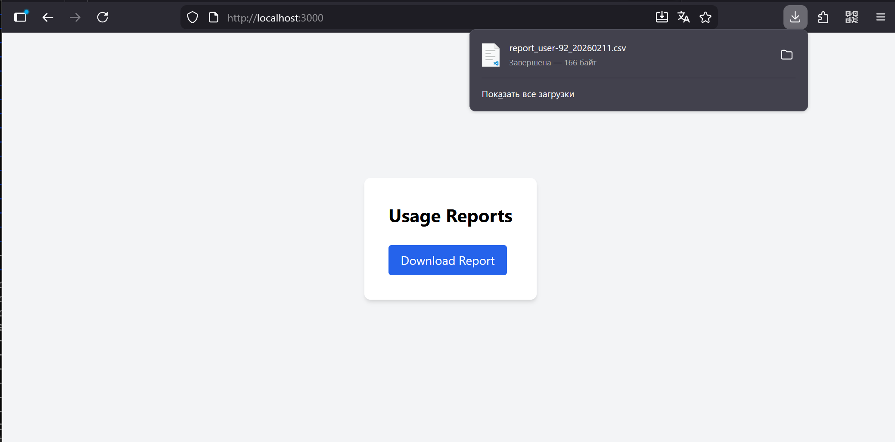

**5. Реализовать ограничение доступа к эндпоинту отчётности.**

При направлении запроса и успешной авторизации запрос представляется на основании UserId находящемся в JWT токене.

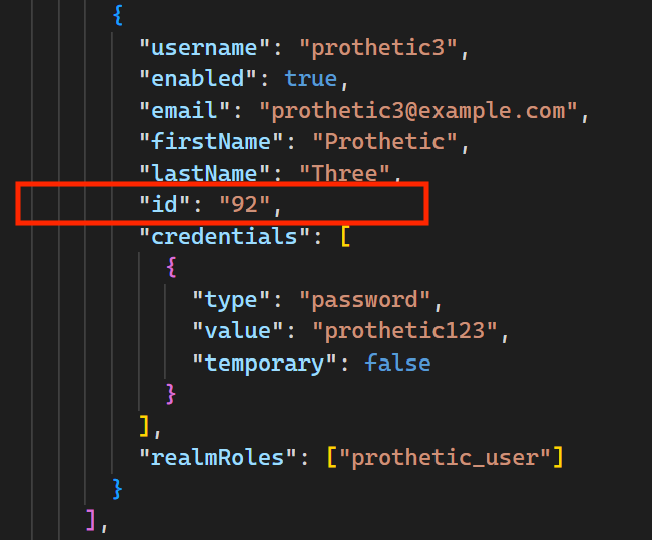
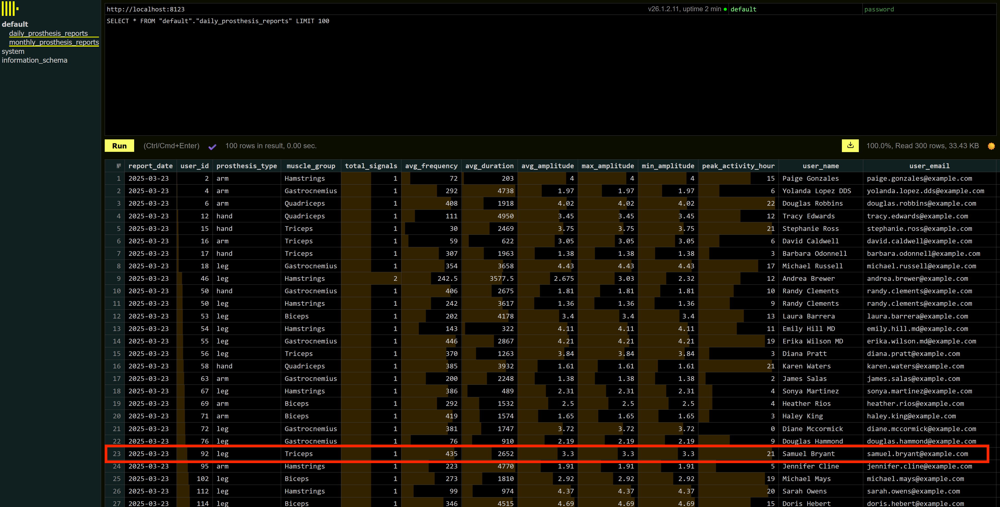
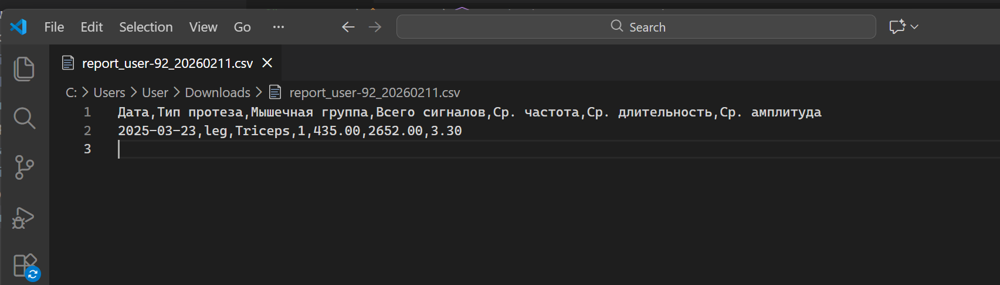

В случае если токен авторизации не передан, или передано неврное значение, метод GET /reports возвращает ответ с кодом 401 Unauthorized.

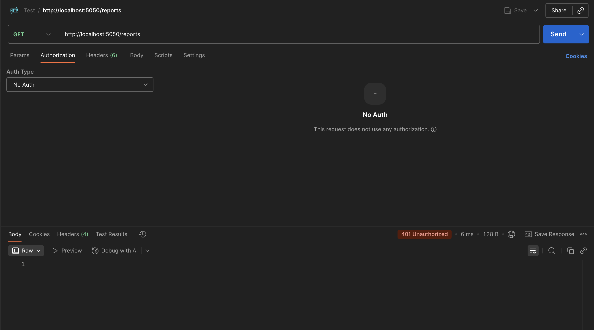